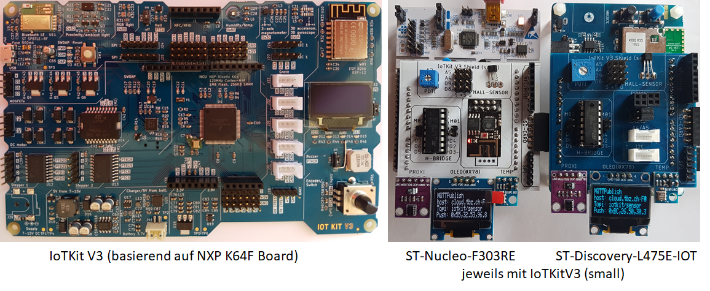

IoTKitV3
========

IoTKit V3 Board

- - -

Beispiele und Dokumentation zum IoTKit V3 und V4 Board bzw. Shield. 

## Grundlagen

* [Hardware](hw/)
* [Software und Installation](sw/)
* [Kleine C/C++ Einführung](ccpp/)
* [GPIO](https://github.com/iotkitv4/gpio)
* [Das Konfigurationssystem (GPIO Belegungen)](config/)
* [Sensoren](https://github.com/iotkitv4/sensors)
* [Aktoren](https://github.com/iotkitv4/actors)

## Bus Systeme

* [UART](https://github.com/iotkitv4/uart)
* [I²C/TWI](https://github.com/iotkitv4/i2c)
* [SPI](https://github.com/iotkitv4/spi)

## WLAN (WiFi) / Bluetooth

* [WLAN (WiFi)](https://github.com/iotkitv4/wlan)
* [Bluetooth](https://github.com/mc-b/IoTKitV3/tree/master/bluetooth) - (**MBED OS 5**)

### Internet IoT Protokolle

* [Sockets (TCP/UDP)](tcpip/)
* [HTTP und REST inkl. Node-RED](https://github.com/iotkitv4/http) - (**MBED OS 5**)
* [MQTT inkl. Node-RED](https://github.com/iotkitv4/mqtt)
* [CoAP](coap/)

## Anwendungen

* [NFC / RFID](https://github.com/iotkitv4/rfid)
* [Edge Computing](edge/)
* [Cloud Anbindung](https://github.com/iotkitv4/cloud) an Amazon (AWS), Google und Microsoft (Azure).
* [Built with Mbed](https://www.mbed.com/built-with-mbed/)

## Erweiterungen

Für die nachfolgenden Beispiele wird evtl. zusätzliche HW, wie z.B. ein Data Logging Shield, benötigt.

* [Speicher APIs](storage/)

## Kurse und Weiterbildung 

* [CAS Internet of Things (IoT) and Digital Ecosystem Technologien verstehen, Lösungen entwickeln](http://hslu.ch/casiot)
* [CAS Cloud and Platform Manager Mit Cloud-Expertise die Digitalisierung mitgestalten](http://hslu.ch/cascpm) 
* [Internet of Things (IoT) im Einsatz](https://www.digicomp.ch/d/IOTEIN)

## Links

* [ARM mbed](https://www.mbed.com)
* [mbed Labs](https://labs.mbed.com/)
* [ARM mbed YouTube Channel](https://www.youtube.com/channel/UCNcxd73dSceKtU77XWMOg8A)
* [Die drei Hauptklassen von IoT](https://www.arm.com/products/iot/soc)
* [Geschäftsmodelle und IoT](https://www.iot-lab.ch/publications/#whitepapers)
* [IoTKit Übersicht alle Versionen](https://github.com/mc-b/IoTKit#internet-der-dinge-kit)

