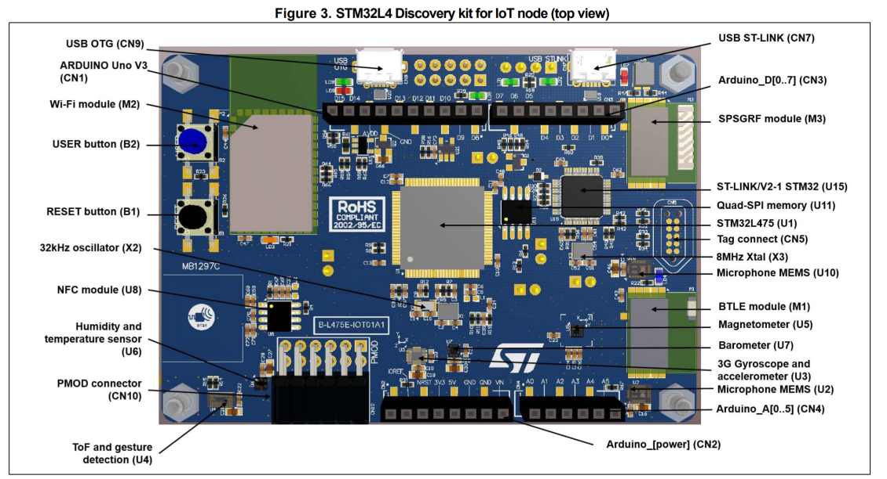
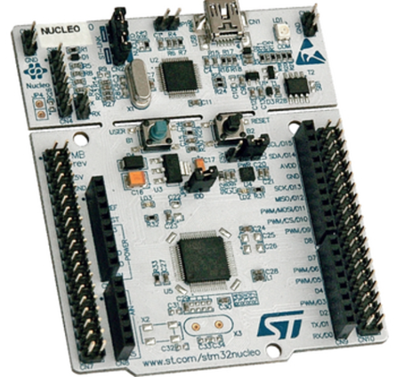
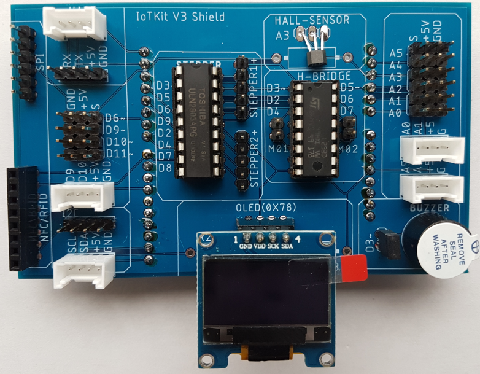
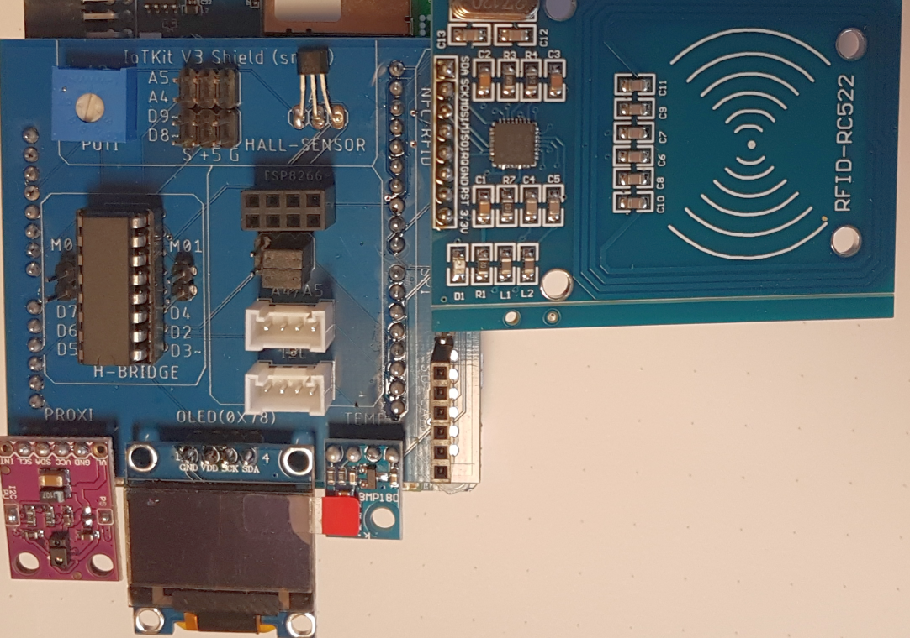

## IoTKit V3
***

> [⇧ **Home**](../README.md)

Der Internet der Dinge Kit V3 besteht aus mehreren Boards, die mit den Beispielen verwendet werden können.

Es sind das 
* [IoTKitV3 K64F](#iotkitv3-k64f) - das eigens für das IoTKit entwickelte Board, basierend auf einen [NXP FRDM-K64F Board](https://os.mbed.com/platforms/FRDM-K64F/). 
* [DISCO-L475VG-IOT01A](#DISCO-L475VG-IOT01A) Board 
* [NUCLEO-F303RE](#NUCLEO-F303RE) Board 

Die letzten zwei Board werden durch einen, für das IoTKitV3 entwickelten, Shield ergänzt. Dieser enthält neben einem OLED Display einen Hall Sensor und Treiber für Motoren.

Zusätzlich liegen dem IoTKitV3 externe [Komponenten](#zubehör) wie Motoren, LED Streifen, Sensoren etc. bei.

Alle Boards können einzeln oder parallel verwendet werden. 

Daneben sollten alle [mbed Boards](https://os.mbed.com/platforms/?q=&Mbed+OS+support=Mbed+OS+6.6), welche ab Mbed OS Version 6.6 unterstützen, funktionieren.

## IoTKitV3 K64F
***

> [⇧ **Nach oben**](#)

Internet der Dinge Board

- - -

Der IoTKit ist ein [NXP FRDM-K64F Board](https://os.mbed.com/platforms/FRDM-K64F/) kompatibles Board.
 
Entstanden ist das Board durch die Kombination des [NXP FRDM-K64F Board](https://os.mbed.com/platforms/FRDM-K64F/) und einzelner Shields (z.B. Erweiterungsshield, Motorshield etc.). Dadurch sind Pin&#039;s doppelt belegt. Überall wo dies der Fall ist, kann immer nur eine Funktion gleichzeitig genutzt werden. Beispiel ist ein Gleichstrom Motor, am 2\. Anschluss angeschlossen, kann nicht gleichzeitig die MOSFET Verstärkerschaltung genutzt werden, weil sich diese die Pin&#039;s D5 - D7 teilen

* [Schaltplan](IoTKitV3.pdf) 

#### Board features

* [Bluetooth® V4.1 module (SPBTLE-RF)](https://github.com/iotkitv3/bluetooth/)
* [Proximity sensor, gesture and ambient light sensing (ALS) module (VL6180X)](https://github.com/iotkitv3/i2c#vl6180x)
* [low power, high sensitivity, RED, GREEN and BLUE color light sensor (RGB)](https://github.com/iotkitv3/i2c#ISL29125)
* [Hall Sensor](../sensors#Hall-Sensor)
* [NFC/RFID Reader](../rfid/)
* [Capacitive digital sensor for relative humidity and temperature (HTS221)](https://github.com/iotkitv3/i2c#hts221)
* [High-performance 3-axis magnetometer (LIS3MDL)](https://github.com/iotkitv3/i2c#lis3mdl)
* [3D accelerometer and 3D gyroscope (LSM6DSL)](https://github.com/iotkitv3/i2c#LSM6DSL)
* [Wi-Fi® module ESP8266](https://github.com/iotkitv3/wlan)

* OpenSDA USB Debug and Programming adapter
* Reset Button
* [SPI Header](https://github.com/iotkitv3/spi/)
* [GND/5V/Signal Arduino Pins D13 - D2](https://github.com/iotkitv3/gpio/)
* [I2C Header](https://github.com/iotkitv3/i2c/)
* [MOSFet](https://github.com/iotkitv3/actors)
* Expansion connectors: Arduino™ Uno V3
* [SWDAP](https://os.mbed.com/teams/mbed/wiki/SWDAP)
* [ARM Cortex M4 K64F MCU](https://www.nxp.com/products/processors-and-microcontrollers/arm-based-processors-and-mcus/kinetis-cortex-m-mcus/k-seriesperformancem4/k6x-ethernet/kinetis-k64-120-mhz-256kb-sram-microcontrollers-mcus-based-on-arm-cortex-m4-core:K64_120)
* [Grove Header](http://wiki.seeedstudio.com/Grove_System/)
* OLED Display
* [4 LED an GPIO D10 - D13](https://github.com/iotkitv3/gpio#DigitalOut)

* [H-Bridge](https://github.com/iotkitv3/actors/)
* [Buzzer](https://github.com/iotkitv3/gpio/)
* [Stepper Driver](https://github.com/iotkitv3/actors/)

* 12 Volt Power Supply
* Charger 5V from batt.
* [GND/5V/Signal Arduino Pins A0 - A5](https://github.com/iotkitv3/gpio/)
* [UART Header](https://github.com/iotkitv3/uart/)

* [Encoder Switch](https://github.com/iotkitv3/gpio)

## DISCO-L475VG-IOT01A
***

> [⇧ **Nach oben**](#)

Der Internet der Dinge Kit V3 Disco besteht aus den nachfolgenden Komponenten.

### Board DISCO-L475VG-IOT01A

Internet der Dinge Disco L475VG Board

- - -

* [mbed Page](https://os.mbed.com/platforms/ST-Discovery-L475E-IOT01A/)
* [Product Page](https://www.st.com/en/evaluation-tools/b-l475e-iot01a.html?icmp=tt5071_gl_bn_apr2017)
* [User Manual](https://www.st.com/content/ccc/resource/technical/document/user_manual/group0/b1/b8/7a/f2/f7/8d/4b/6b/DM00347848/files/DM00347848.pdf/jcr:content/translations/en.DM00347848.pdf)
* [Schematics](https://www.st.com/resource/en/schematic_pack/b-l475e-iot01ax_sch.zip)

#### Board features

* 64-Mbit Quad-SPI (Macronix) Flash memory
* Bluetooth® V4.1 module (SPBTLE-RF)
* Sub-GHz (868 or 915 MHz) low-power-programmable RF module (SPSGRF-868 or SPSGRF-915)
* [Wi-Fi® module Inventek ISM43362-M3G-L44 (802.11 b/g/n compliant)](https://github.com/iotkitv3/wlan)
* Dynamic NFC tag based on M24SR with its printed NFC antenna
* 2 digital omnidirectional microphones (MP34DT01)
* [Capacitive digital sensor for relative humidity and temperature (HTS221)](https://github.com/iotkitv3/i2c#HTS221)
* [High-performance 3-axis magnetometer (LIS3MDL)](https://github.com/iotkitv3/i2c#LIS3MDL)
* [3D accelerometer and 3D gyroscope (LSM6DSL)](https://github.com/iotkitv3/i2c#LSM6DSL)
* 260-1260 hPa absolute digital output barometer (LPS22HB)
* [Time-of-Flight and gesture-detection sensor (VL53L0X)](https://github.com/iotkitv3/i2c#VL53L0X)
* [2 push-buttons (user and reset)](https://github.com/iotkitv3/gpio)
* USB OTG FS with Micro-AB connector
* Expansion connectors:
* Arduino™ Uno V3
* PMOD

## NUCLEO-F303RE
***

Internet der Dinge Board Nucleo F303 RE
- - -

Das STM32 Nucleo-Board bietet Anwendern eine erschwingliche und flexible Möglichkeit, neue Ideen auszuprobieren und Prototypen zu bauen.

#### Board features

STM32F303RET6 in LQFP64 package
ARM®32-bit Cortex®-M4 CPU, 72 MHz max CPU frequency
512 KB Flash, 80 KB SRAM
GPIO (51) with external interrupt capability, 12-bit ADC (4), 12-bit DAC (2)
RTC, Timers (10)
I2C (3), USART (5), SPI (4), USB 2.0 full-speed, CAN

* [mbed Page](https://os.mbed.com/platforms/ST-Nucleo-F303RE/)

## Shield
***

Internet der Dinge Shield 

- - -

Der IoTKit V3 Shield ist ein Arduino Header kompatibler Shield.

Shield features
* 1 x SPI Header
* 1 x NFC/RFID Reader Header
* 2 x UART Header (1x Grove)
* 4 x Servo 4x3 Header
* 2 x I2C Header (1x Grove)
* 1 x Leistungsstufe für Schrittmotoren, Türöffner oder für die Ansteuerung von LED Streifen
* 1 x Hall Sensor
* 1 x OLED (128x64 Pixel)
* 1 x H-Bridge für 2 DC Motoren
* 8 x Analog/Digital 6x3 Header und 2 x Grove
* 1 x Buzzer

## Shield (small)

Internet der Dinge Shield (small)

- - -

Der IoTKit V3 Shield (small) ist die abgespeckte Variante des IoTKit Shields. 

Shield features
* 1 x SPI Header
* 1 x NFC/RFID Reader Header
* 1 x I2C Header (Grove)
* 1 x SD Card Header
* 1 x Hall Sensor
* 1 x OLED (128x64 Pixel)
* 1 x H-Bridge für 2 DC Motoren
* 4 x Analog/Digital 6x3 Header z.B. für Sensoren und Servos
* 1 x Grove
* 1 x Anschluss für BMP180 Sensor für die Messung von Luftdruck und Temperatur.
* 1 x Anschluss für APDS-9930 ein Umgebungslicht (ALS) und Näherungssensor

## Zubehör
***

> [⇧ **Nach oben**](#)

*   **Sensoren** RFID Reader (MFRC-522), PIR Sensor (SR501), Ultrasonic Wave Detector Ranging Module (HC-SR04), Digital Temperature and Humidity Sensor (DHT11), Microswitch Limit Switch: [AliExpress](http://www.aliexpress.com/), [EBay](http://www.ebay.ch/), [Conrad](http://www.conrad.ch/) (teilweise)
*   **Aktoren** 5V Stepper Motor (28BYJ-48), DC Motor, Wheels, 9g Mini Micro Servo (SG90): [AliExpress](http://www.aliexpress.com/), [EBay](http://www.ebay.ch/), [Conrad](http://www.conrad.ch/) (teilweise)
*   **LED Strip&#039;s, Matrix** Led Pixel Strip (WS2801 - Variante mit 4 Adern beachten!), Dot LED Matrix: [AliExpress](http://www.aliexpress.com/), [EBay](http://www.ebay.ch/)
*   **Modems** USB To RS232 TTL Konverterkabel: [AliExpress](http://www.aliexpress.com/), [EBay](http://www.ebay.ch/)
*   **IC&#039;s, Transistoren, Widerstände, Kabel, Stecker (Crimp) etc.** [http://www.distrelec.ch/](http://www.distrelec.ch/), [https://www.reichelt.de/](https://www.reichelt.de/), [Pusterla (Ladengeschäft in Zürich)](http://www.pusterla.ch/)

Die restlichen Teile zum Drucken, mittels 3D Drucker, sind auf [http://www.thingiverse.com/](http://www.thingiverse.com/thing:805047) zu finden. Dort befindet sich auch die Dateien um die IoTKit Box, mittels einer CNC Maschine, zu fräsen. Zum Befestigen der Teile werden 2 x M3x20 Linsenschrauben mit Muttern (Schrittmotor ), 1 x M3x30 Linsenschraube mit Mutter (Motorklammer) und zwei Drahtstife (Nägel) mit Durchmesser 1.5mm o.ä. für den Endschalter benötigt.